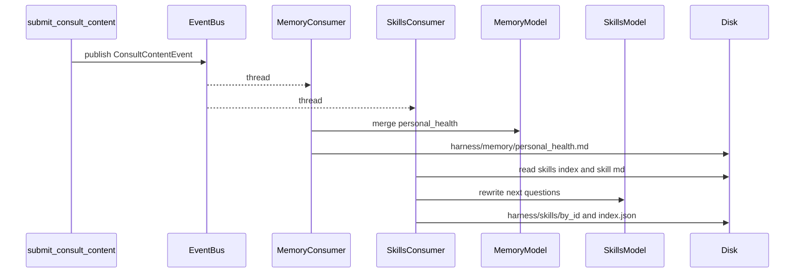

# post_manager_layer

本包负责：**在「问诊结构化提交」与多个异步下游之间做解耦**。主对话里的工具 `submit_consult_content` 校验并写审计日志后 `publish` 同一 [`ConsultContentEvent`](./events.py)；各消费者在后台线程中并行执行。

当前默认订阅两类消费者：

1. **记忆沉淀**：合并/压缩并写入 `harness/memory/personal_health.md`（`memory_*` API 配置）。
2. **问诊 skill 进化**：根据本轮结构化问诊更新「下次建议问题」Markdown 与 `harness/skills/index.json`（`skills_*` API 配置，与主 Agent 默认相同，可单独切换）。

---

## 和「消息队列」的关系

这里**没有**使用 RabbitMQ、Kafka 等外部消息中间件，实现的是进程内的：

- **事件总线（Event Bus）**：`publish` 时把同一个事件**扇出**给所有 `subscribe` 的处理器；
- **后台线程**：每个处理器在独立 `threading.Thread`（daemon）里运行，避免阻塞工具返回。

| 常见 MQ 概念 | 本包现状 |
|-------------|---------|
| 消息持久化在 Broker | 事件是内存中的 Python 对象；**审计**靠 `logs/consult_content.jsonl`（非消费队列） |
| 多消费者抢一条消息 | 这里是**广播**：每个订阅者各收到一份相同事件 |
| 进程崩溃不丢消息 | 当前实现**不保证**未跑完的后台任务；可按 jsonl 自行做重放 |

---

## 端到端时序（submit → 记忆 + skills 并行）



**文字要点：**

1. `agent_loop` 启动时 `setup_post_manager_layer` 会 `init_event_bus` 并 `subscribe` 记忆消费者与 **skills 消费者**（见 [`bootstrap.py`](./bootstrap.py)）。
2. `submit_consult_content` → 写 `logs/consult_content.jsonl` → `publish(event)` → 立即返回。
3. **Memory**：[`memory_consumer.py`](./memory_consumer.py) 使用 `memory_*` 配置写 `personal_health.md`。
4. **Skills**：[`skills_consumer.py`](./skills_consumer.py) 使用 `skills_*` 配置更新 `harness/skills/by_id/<slug>.md` 与 `harness/skills/index.json`；slug 由 `symptom_course` 稳定派生（见 `skill_slug_from_course`）。
5. 主对话侧 **system** 仍只注入长期记忆（[`io.read_health_memory_block`](./io.py)）；问诊 skill 由工具 [`load_consult_skill`](../tools/load_consult_skill_tool.py) 加载进对话。

---

## 模块一览

| 文件 | 职责 |
|------|------|
| `bootstrap.py` | 初始化总线并注册记忆 + skills 消费者 |
| `bus.py` | `EventBus`：`subscribe` / `publish`（扇出 + 每 handler 一线程） |
| `events.py` | `ConsultContentEvent` |
| `memory_consumer.py` | 长期记忆合并/压缩；`_memory_write_lock`；接入模型的 system 见 [`config/system_prompt.py`](../config/system_prompt.py) 中 `MEMORY_CONSUMER_*` |
| `skills_consumer.py` | 问诊 skill 更新；索引读写、`skill_slug_from_course`、`_skills_write_lock`；system 见同文件 `SKILLS_CONSUMER_SYSTEM_PROMPT` |
| `chat_client.py` | `post_chat_completion`（httpx） |
| `io.py` | `read/write_health_memory`、`read_health_memory_block`；**以及** `read_skill_md` / `write_skill_md`（均不走主 Agent `write_file`） |
| `paths.py` | memory / logs / **skills** 路径 |
| `context.py` | 工具执行时的 `session_id`（`ContextVar`） |

---

## 扩展：再增加消费者

```python
from post_manager_layer.bus import get_event_bus
from post_manager_layer.events import ConsultContentEvent

def my_handler(event: ConsultContentEvent) -> None:
    ...

get_event_bus().subscribe(my_handler)
```

---

## 配置

- **记忆**：`MEMORY_MODEL_ID`、`MEMORY_API_KEY`、`MEMORY_DEEPSEEK_BASE_URL`、`MEMORY_MAX_CHARS`、`MEMORY_MIN_CHARS`（见 [`config/api_key.py`](../config/api_key.py)）。
- **Skills 沉淀**：`SKILLS_MODEL_ID`、`SKILLS_API_KEY`、`SKILLS_DEEPSEEK_BASE_URL`；未设置时与主对话 `MODEL_ID` / `DEEPSEEK_*` 一致。

---

## 相关代码（包外）

- [`agent_core/loop_core.py`](../agent_core/loop_core.py)
- [`tools/submit_consult_content_tool.py`](../tools/submit_consult_content_tool.py)
- [`tools/load_consult_skill_tool.py`](../tools/load_consult_skill_tool.py)
- [`config/system_prompt.py`](../config/system_prompt.py)
